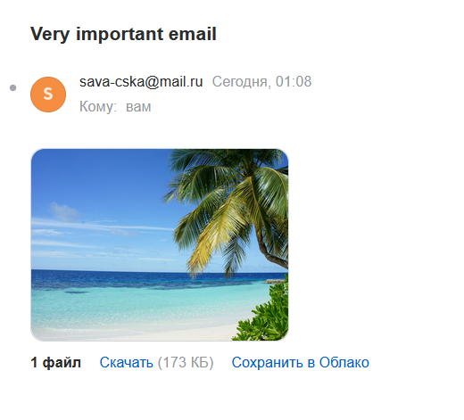

Для сборки проекта достаточно написать `pip install .`

Чтобы запустить клиента из задания 1, в командной строке надо написать `send_with_smtplib receiver_email -type={txt/html} -file=path_to_file_with_message`. Параметры `-type` и `-file` опциональны, по умолчанию используются значения `type = txt` и `file = examples/txt_email.txt`.

Пример запуска клиента из первого задания:

`send_with_smtplib vasya-pupkin@gmail.com`

`send_with_smtplib vasya-pupkin@gmail.com -type=html -file="examples/html_email.txt"`

Чтобы запустить клиента из задания 2 и 3, в командной строке надо написать `send_with_socket receiver_email -type={text/image} -file=path_to_file_with_message`. Параметры `-type` и `-file` опциональны, по умолчанию используются значения `type = text` и `file = examples/txt_email.txt`.

Пример запуска клиента из второго и третьего заданий:

`send_with_socket vasya-pupkin@gmail.com`

`send_with_socket vasya-pupkin@gmail.com -file="examples/html_email.txt"`

`send_with_socket vasya-pupkin@gmail.com -type=image -file="examples/pic.jpg"`

Скриншот к третьему заданию

